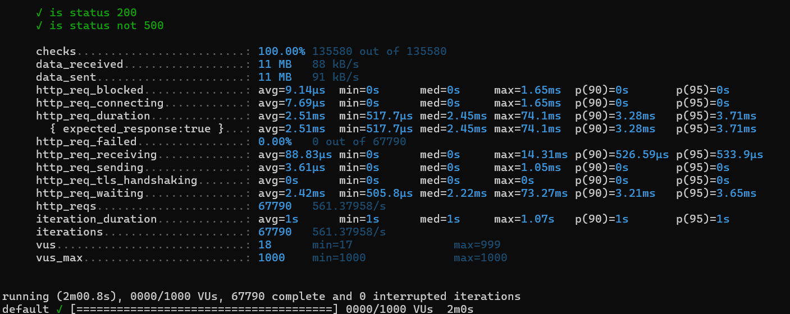
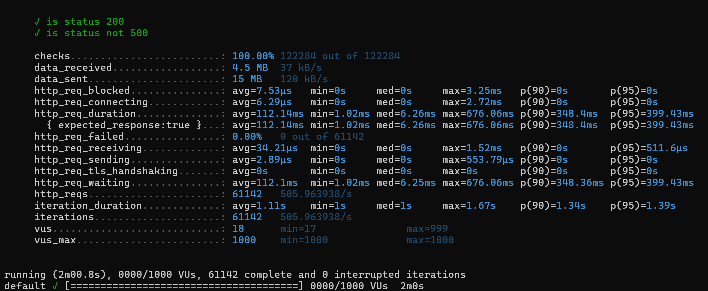

## Переменные окружения:
Для упрощения .env лежит в репозитории.
***
## Запуск:
**Находясь  в корневой папке проекта** выполнить команду Docker:
<br>
`docker-compose up --build -d`
<br>
или
<br>
`docker-compose up --build`

Можно менять переменные в .env. После внесения изменений пересобирать проект не нужно, достаточно выполнить команду `docker-compose up`

***
## Как пользоваться:
Эндпоинты описаны Swagger, так что при запущенном сервисе можно перейти на
http://localhost:8080/swagger-ui.html. Примеры вводных данных представлены.

Также есть возможность протестировать через **Postman**

Примеры запросов:
* GET `localhost:8080/api/v1/wallet/550e8400-e29b-41d4-a716-446655440000`
* POST `localhost:8080/api/v1/wallet` с телом запроса: <br> 
```json
{
    "wallet_id": "550e8400-e29b-41d4-a716-446655440000",
    "operation_type": "DEPOSIT",
    "amount": 1000
}
```

***
## Liquibase:
Миграции в проекте реализоваы с использованием **Liquibase**. Логи изменений находятся в resources/db/changelog/2025/03;
<br>
Таблица Wallet проиндексирована, для упрощения тестирования в базу занесены 5 кошельков.

***
## Важно:
Реализован глобальный обработчик исключений, предусмотрены условия некорректных данных и т.п.

***
## Нагрузочное тестирование:
Тестирование проводилось через **Grafana k6**. Если хотите протестировать сами, то потребуется:
* Установить k6: https://grafana.com/docs/k6/latest/set-up/install-k6/;
* При запущенном приложении выполнить команду `k6 run loadtest_post_method.js` или `k6 run loadtest_get_method.js`;

### Результаты нагрузочного тестирования:


